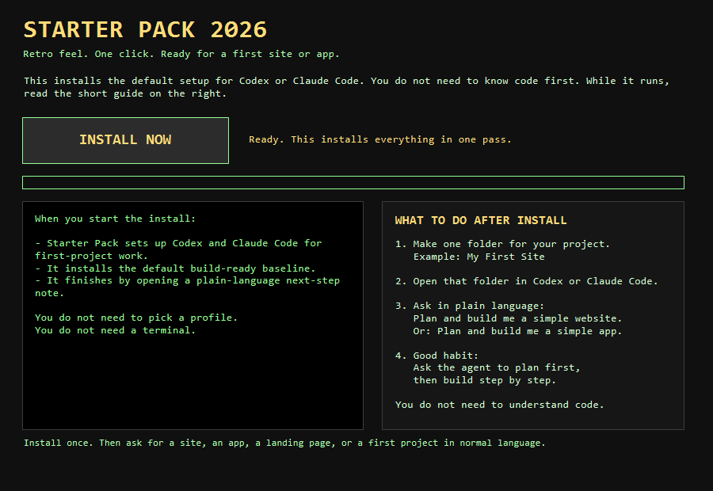

# Starter Pack 2026 for Windows

A beginner-friendly setup pack for Codex and Claude Code on Windows.

This is for real people, not just developers.
You do not need to know code before using it.

## What this does

Starter Pack installs a calm, build-ready baseline so a new user can open Codex or Claude Code and say things like:

- Build me a simple website
- Build me a simple app
- Make me a short presentation for my class or business
- Make me a landing page for my business
- Help me plan and build my first project step by step

The visible user path is simple:

1. Download the latest ZIP from GitHub Releases.
2. Extract it.
3. Double-click `INSTALL-STARTER-PACK.cmd`.
4. Wait while Starter Pack installs.
5. Read the short next-step note that opens automatically.

## Installer preview

## What the user sees in the ZIP

- `OPEN-THIS-FIRST.txt`
- `INSTALL-STARTER-PACK.cmd`
- `STARTER-PACK-LAUNCHER.ps1`
- `WHAT-TO-DO-NEXT.txt`
- `PASTE-INTO-CODEX-OR-CLAUDE-INSTALL.txt`
- `starter-pack/`

## Two ways to use it

### 1. Click-to-install

Double-click `INSTALL-STARTER-PACK.cmd`.

That is the main beginner path.
The installer starts automatically and finishes by opening a plain-language next-step note.

### 2. Copy-paste into Codex or Claude Code

If the user already opened Codex or Claude Code, they can open `PASTE-INTO-CODEX-OR-CLAUDE-INSTALL.txt`, copy the text, and paste it into the chat.

## What gets installed

Starter Pack installs the beginner baseline into the user's Windows profile folders, not into the current project.

For Codex:

- `%USERPROFILE%\.codex\AGENTS.md`
- `%USERPROFILE%\.codex\config.toml`
- `%USERPROFILE%\.codex\skills\...`

For Claude Code:

- `%USERPROFILE%\.claude\CLAUDE.md`
- `%USERPROFILE%\.claude\settings.json`
- `%USERPROFILE%\.claude\skills\...`

Shared support files:

- `%USERPROFILE%\.starter-pack\backups\...`
- `%USERPROFILE%\.starter-pack\install-receipt.json`

## What this includes

- global instruction files for Codex and Claude Code
- workflow skills for planning, deep research, execution, debugging, verification, and worktree discipline
- build-ready defaults for first websites and apps, plus presentation help, including bold frontend direction, design elevation, UI review, browser checking, deploy guidance, and React guidance
- Context7 MCP
- Sequential Thinking MCP
- optional GitHub read-only MCP
- safety deny rules for common secret locations

## What this does not do

- it does not ask the user to understand profiles
- it does not force a terminal-first workflow
- it does not install giant random bundles
- it does not ask a beginner to choose React vs Next.js before first value

## First-time guidance after install

After install, the product tells the user to:

1. Make one folder for the first project
2. Open that folder in Codex or Claude Code
3. Ask in normal language for a site, app, or presentation
4. Ask the agent to plan first, then build step by step

## Files for maintainers

- `starter-pack/INSTALL.ps1` - installer
- `starter-pack/VERIFY.ps1` - verification
- `starter-pack/UNINSTALL.ps1` - rollback helper
- `starter-pack/CHANGELOG.md` - version history
- `starter-pack/PRD.md` - product spec
- `GITHUB-RELEASE-BODY-v0.6.6.md` - ready release text
- `FACEBOOK-POST.md` - ready social post text
- `PUBLISH-CHECKLIST.md` - ready publish checklist

## Current version

`v0.6.6`
